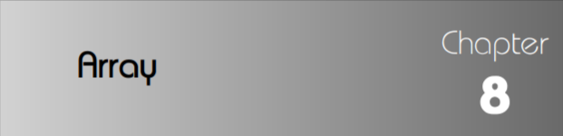

# Array Introduction



An array is a fixed-size sequenced collection of elements of the same data type. It is simply a grouping of like-type data. In its simplest form, an array can be used to represent a list of numbers or a list of names.

An array is a very popular and useful data structure used to store data elements in successive memory locations. More than one element is stored in a sequence, so it is also called a composite data structure. An array is a linear and homogeneous data structure. An array permits homogeneous data. It means that similar types of elements are stored contiguously in the memory and that too under one variable name.

It can be combined with a non-homogeneous structure, and a complex data structure can be created. We know that an array of structured objects can also be useful. An array can be declared of any standard or custom data type. The array of character (strings) type works somewhat differently from an array of integers, and floating numbers.

Some examples where the concept of an array can be used:

* List of temperatures recorded every hour in a day, or month, or year.
* List of employees in an organization.
* List of products and their cost sold by a store.
* Test scores of a class of students.
* List of customers and their telephone numbers.
* Table of daily rainfall data.

### Why Array over conventional methods

So far we have used only the fundamental data types, namely char, int, float, double, and variations of int and double. Although these types are very useful, they are constrained by the fact that a variable of these types can store only one value at any given time. Therefore, they can be used only to handle limited amounts of data. In many applications, however, we need to handle a large volume of data in terms of reading, processing, and printing. To process such large amounts of data, we need a powerful data type that would facilitate efficient storing, accessing, and manipulation of data items. C supports a derived data type known as an array that can be used for such applications

Since an array provides a convenient structure for representing data, it is classifi ed as one of the data structures in C.

As we mentioned earlier, an array is a sequenced collection of related data items that share a common name. For instance, we can use an array name salary to represent a set of salaries of a group of employees in an organization. We can refer to the individual salaries by writing a number called index or subscript in brackets after the array name. For example, `salary [10]` represents the salary of the 10th employee. While the complete set of values is referred to as an array, individual values are called elements

The ability to use a single name to represent a collection of items and to refer to an item by specifying the item number enables us to develop concise and effi cient programs. For example, we can use a loop construct, discussed earlier, with the subscript as the control variable to read the entire array, perform calculations, and print out the results.

#### How Are Arrays Useful?

To see the usefulness of arrays, consider the problem of reading the age of 5 persons, printing them out individually and computing the average. Here is a solution that does not use arrays.

```
#include <stdio.h>
main(){
int a1,a2,a3,a4,a5;
float sum=0;
printf("Age: ");
scanf( "%d", &a1 );
sum+=a1;
printf( "Age: " );
scanf( "%d", &a2 );
sum+=a2;
printf( "Age: " );
scanf( "%d", &a3 );
sum+=a3;
printf( "Age: " );
scanf( "%d", &a4 );
sum+=a4;
printf( "Age: " );
scanf( "%d", &a5 );
sum+=a5;
printf( "The ages that were input are:\n" );
printf( "%d\n", a1 );
printf( "%d\n", a2 );
printf( "%d\n", a3 );
printf( "%d\n", a4 );
printf( "%d\n", a5 );
printf( "Average = %f\n", sum/5);
}
```

The program is very simple. It reads the ages of 5 persons, adds them up in a variable called sum, and at the end, divides sum by 5 to get the average age. Needless to say, this is a very clumsy way to write a program. If there are a large number of persons, the number of statements increases proportionately. To avoid this, use a loop. But the problem is that different variables are needed to store the ages of different persons and hence, the loop will have to store and print different variables each time. A more elegant way is to use an array of integers to store the ages, as shown in the example below.

```
#include <stdio.h>
void main(){
int age[5]; /*Array Of 5 ages, declaration for an array*/
int i,n;
float sum=0;
printf(" Number of persons: ");
scanf( "%d", &n );
if(n<=0 || n>5)
    printf(" Invalid number of persons entered.\n" );
else{
    for(int i=0;i<n;i++){
        printf( "Age: " );
        scanf( "%d", &age[ i ] );
        sum+=age[i];
        }
    printf("The ages input are : \n");
    for(i=0;i<n;i++)
        printf("%d\n",age[i]);
    printf("The average is: %f\n",sum/n);
    } /* end else */
} /* end main */

```

We can use arrays to represent not only simple lists of values but also tables of data in two, three or more dimensions. In this chapter, we introduce the concept of an array and discuss how to use it to create and apply the following types of arrays:-

* One-dimensional arrays
* Two-dimensional arrays
* Multidimensional arrays
